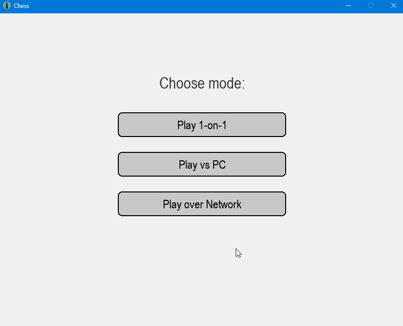
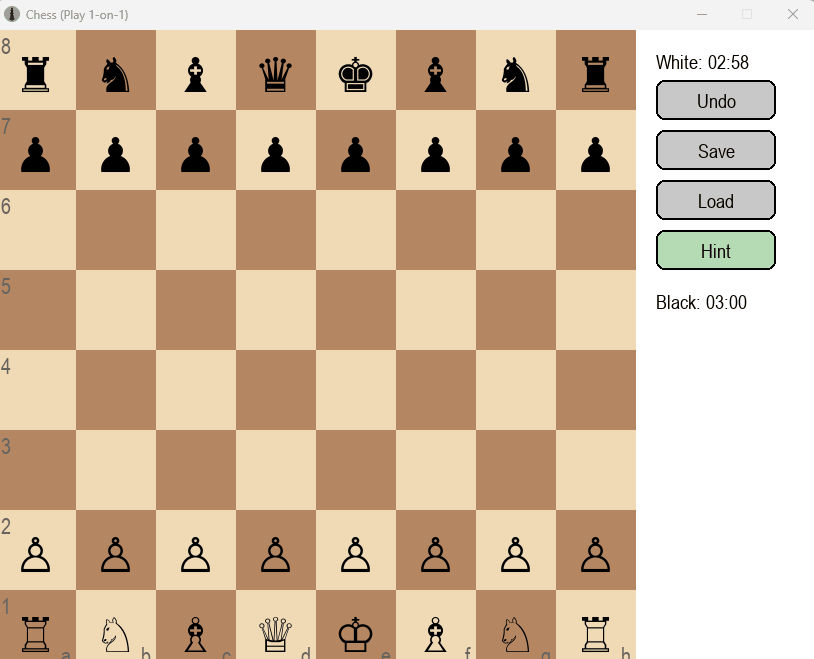
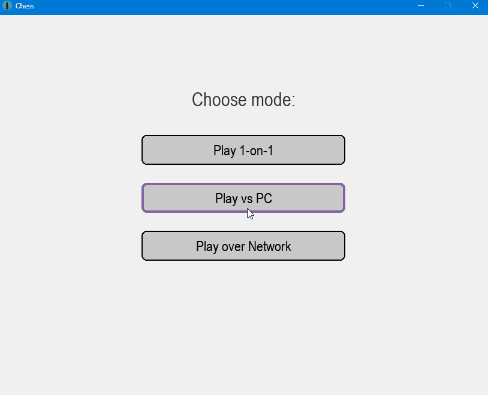
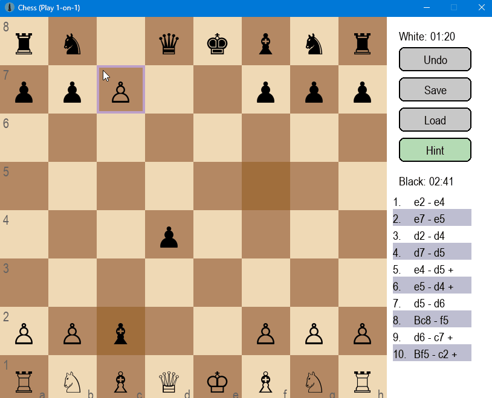

# Chess


A desktop chess game built with **Python** and **Pygame**.

The project includes local play, bot play, network mode, chess rule validation, move history, animations, sounds, timers, JSON save/load, code quality checks, CI, and automated tests for core chess rules.

## Features

* Local 1 vs 1 chess mode
* Play against an Alpha-Beta bot
* Network mode: host or join a game
* Legal move validation
* Check, checkmate, and stalemate detection
* Castling
* En passant
* Pawn promotion
* Threefold repetition detection
* Fifty-move rule
* Insufficient material detection
* Move history panel with scrolling
* Undo move
* Time control selection
* Save/load game state using JSON
* Autosave support
* Sound effects
* Move animations
* Promotion selection dialog
* UI overlays for hints, illegal moves, and waiting state
* Automated tests for chess rules and UI helper logic
* Ruff linting
* GitHub Actions CI
  
## Demo
### Main Menu

The main menu allows the player to choose between local play, bot mode, and network mode.
After selecting a game mode, the player can choose a time control before starting the game.



### Gameplay

The gameplay demo shows piece selection, legal move hints, move animation, last-move highlighting, timers, and the move history panel.
The game validates legal moves and updates the board state after every move.



### Bot Mode

The bot mode demo shows the player making a move as White and the computer responding as Black.
The bot uses Alpha-Beta search with basic evaluation to choose its move.



### Pawn Promotion

The promotion demo shows a pawn reaching the last rank and opening the promotion dialog.
The player can choose a queen, rook, bishop, or knight, and the selected piece is placed on the board.




## Tech Stack

* Python
* Pygame
* Pillow
* Pytest
* Ruff
* Socket networking
* Tkinter file dialogs
* GitHub Actions


## Installation

Clone the repository:

```bash
git clone https://github.com/PavloNaichuk/Projects.git
cd Projects/Desktop/Chess
```

Create and activate a virtual environment:

```bash
python -m venv .venv
```

On Windows PowerShell:

```powershell
.\.venv\Scripts\Activate.ps1
```

Install dependencies:

```bash
python -m pip install --upgrade pip
python -m pip install -r requirements.txt
```

For development and testing, install development dependencies:

```bash
python -m pip install -r requirements-dev.txt
```

## Run the Game

```bash
python main.py
```

## Run Tests

```bash
python -m pytest -q
```

## Run Linting

```bash
python -m ruff check .
```

To auto-fix formatting/import issues:

```bash
python -m ruff check . --fix
```

## Game Modes

### Local Mode

Two players can play on the same computer.

### Bot Mode

The player controls White and the bot controls Black.

The bot uses:

* Alpha-Beta search
* Move ordering
* Basic evaluation
* Quiescence search for capture moves

### Network Mode

One player hosts the game and another player joins by entering the host IP address.

Network mode supports normal moves and pawn promotion.

## Chess Logic Coverage

Automated tests cover important chess rules and edge cases, including:

* Legal and illegal piece movement
* Pawn movement and captures
* Knight, bishop, rook, queen, and king movement
* Check detection
* Checkmate detection
* Stalemate detection
* King safety
* Pinned pieces
* Blocking check
* Capturing checking pieces
* Double check
* Castling rules
* Castling rights after king/rook movement or rook capture
* En passant
* En passant edge cases that expose the king
* Pawn promotion
* Promotion with capture
* Invalid promotion rejection
* Undo after special moves
* FEN parsing and serialization
* Position keys for repetition detection
* Threefold repetition
* Fifty-move rule
* Insufficient material
* Move generation integrity
* Basic perft checks
* Bot smoke tests
* JSON save/load behavior

## UI and Helper Modules

The UI code has been split into smaller modules:

* `graphics.py` — main game loop and event handling
* `sidebar.py` — right panel, buttons, timers, move history, scrollbar
* `ui_overlays.py` — last-move highlight, selected square, hints, wait overlay, illegal move overlay
* `promotion_dialog.py` — pawn promotion selection dialog
* `file_dialogs.py` — save/load file dialogs
* `sound_manager.py` — sound loading and playback
* `mouse_utils.py` — mouse position and board-click helpers
* `scroll_utils.py` — move history scrolling helpers
* `move_notation.py` — move formatting for the history panel

## Save and Load

The game state is saved in JSON format.

Autosave file:

```text
autosave.json
```

This file should not be committed to Git.

## Continuous Integration

The project uses GitHub Actions CI.

CI checks include:

* Ruff linting
* Python file compilation
* Pytest test suite

## Notes

This project is focused on Python desktop development and chess game logic.

It demonstrates:

* Object-oriented programming
* Game loop architecture
* Board state management
* Legal move generation
* Special chess rules
* Basic AI search
* Socket communication
* JSON persistence
* UI refactoring
* Automated testing
* CI/CD basics
