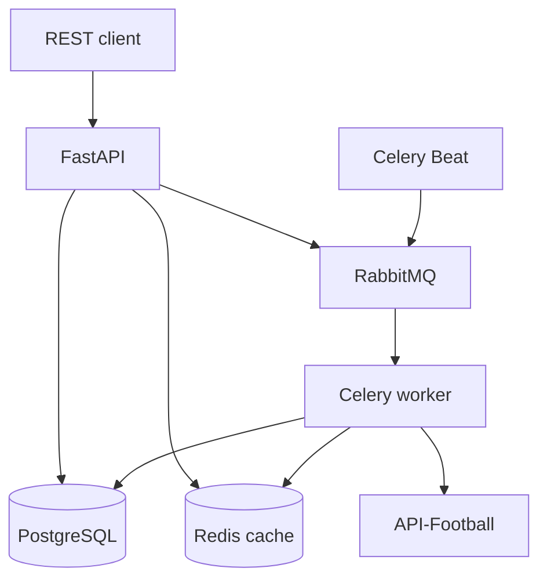

# Football Data Pipeline

Асинхронний сервіс збору, збереження й видачі футбольних даних із
API-Football. Проєкт охоплює повний шлях від зовнішнього API до PostgreSQL,
фонових Celery-задач, Redis-кешу та FastAPI REST API.

## Можливості

- синхронізація ліг, сезонів, команд, матчів і турнірних таблиць;
- події, статистика та склади для окремого матчу;
- фонові задачі через Celery і RabbitMQ;
- періодичні оновлення через Celery Beat;
- опційне опитування live-матчів;
- Redis-кеш для агрегованої сторінки матчу з автоматичною інвалідацією;
- PostgreSQL-моделі та послідовні Alembic-міграції;
- health/readiness endpoints, JSON-логи та `X-Request-ID`;
- повний Docker Compose стек і GitHub Actions CI.

## Архітектура



## Швидкий запуск через Docker

Потрібні Docker Desktop і Docker Compose.

1. Створіть локальний конфігураційний файл:

   ```powershell
   Copy-Item .env.example .env
   ```

2. У `.env` обов'язково замініть:

   - `POSTGRES_PASSWORD`;
   - `RABBITMQ_PASSWORD`;
   - `API_FOOTBALL_KEY` на ключ із кабінету API-Football.

   Реальний API-ключ зберігайте лише в `.env`. Файл уже виключений із Git і
   Docker build context.

3. Зберіть і запустіть весь стек:

   ```powershell
   docker compose up --build -d
   docker compose ps
   ```

   Compose автоматично дочекається інфраструктури, застосує міграції та
   запустить API, worker і scheduler.

4. Перевірте сервіси:

   ```powershell
   Invoke-RestMethod http://127.0.0.1:8000/health
   Invoke-RestMethod http://127.0.0.1:8000/ready
   ```

   Документація API: <http://127.0.0.1:8000/docs>

5. Запустіть повне первинне завантаження ліги:

   ```powershell
   $body = @{ league_id = 39; season = 2024 } | ConvertTo-Json
   $task = Invoke-RestMethod `
     -Method Post `
     -Uri http://127.0.0.1:8000/tasks/pipeline/sync `
     -ContentType application/json `
     -Body $body

   Invoke-RestMethod "http://127.0.0.1:8000/tasks/$($task.task_id)"
   ```

6. Зупинити стек:

   ```powershell
   docker compose down
   ```

   Щоб також видалити локальні дані PostgreSQL, Redis і RabbitMQ:

   ```powershell
   docker compose down -v
   ```

## Локальна розробка

Для локального запуску рекомендовано Python 3.10.

```powershell
python -m venv .venv
Set-ExecutionPolicy -Scope Process -ExecutionPolicy RemoteSigned
.\.venv\Scripts\Activate.ps1
python -m pip install --upgrade pip
python -m pip install -r requirements-dev.txt
Copy-Item .env.example .env
docker compose up -d postgres redis rabbitmq
python -m alembic upgrade head
python -m uvicorn app.main:app --reload
```

Worker і Beat запускаються в окремих PowerShell-вікнах з активованим `.venv`:

```powershell
python -m celery -A app.tasks.celery_app:celery_app worker `
  --loglevel=INFO --pool=solo --without-mingle --without-gossip
```

```powershell
python -m celery -A app.tasks.celery_app:celery_app beat --loglevel=INFO
```

На Windows для worker використовується `--pool=solo`. У Docker/Linux worker
використовує звичайний prefork pool.

## Основні endpoints

| Метод | Шлях | Призначення |
|---|---|---|
| `GET` | `/health` | Перевірка процесу API |
| `GET` | `/ready` | PostgreSQL, Redis і RabbitMQ readiness |
| `GET` | `/leagues` | Список ліг |
| `GET` | `/teams` | Команди з фільтрами |
| `GET` | `/fixtures` | Матчі з фільтрами |
| `GET` | `/fixtures/{id}/details` | Матч, події, статистика і склади |
| `GET` | `/standings/{league_id}/{season}` | Таблиця сезону |
| `POST` | `/tasks/pipeline/sync` | Повна базова синхронізація |
| `POST` | `/tasks/fixtures/live/sync` | Оновлення live-матчів |
| `GET` | `/tasks/{task_id}` | Статус фонової задачі |

У Swagger UI доступні також окремі sync endpoints для ліг, команд, матчів,
таблиці, подій, статистики та складів.

## Періодичне оновлення

Звичайні матчі й турнірна таблиця оновлюються за інтервалами з `.env`.
Live polling вимкнений за замовчуванням:

```dotenv
LIVE_FIXTURE_SYNC_ENABLED=false
LIVE_FIXTURE_SYNC_INTERVAL_SECONDS=30
```

Увімкніть його лише якщо тариф API-Football має достатню квоту. Безкоштовний
план не розрахований на запит кожні 30 секунд протягом усього дня.

Для періодичного повного pipeline можна використати:

```dotenv
PIPELINE_SYNC_ENABLED=true
PIPELINE_SYNC_INTERVAL_SECONDS=86400
```

За замовчуванням ця опція вимкнена, щоб не дублювати окремі планові задачі й
не витрачати API-квоту.

## Конфігурація

Усі параметри читаються з environment variables або `.env`. Повний шаблон є
у `.env.example`.

| Група | Основні змінні |
|---|---|
| Application | `ENVIRONMENT`, `LOG_LEVEL`, `API_PORT` |
| PostgreSQL | `POSTGRES_HOST`, `POSTGRES_PORT`, `POSTGRES_DB`, `POSTGRES_USER`, `POSTGRES_PASSWORD` |
| Redis | `REDIS_HOST`, `REDIS_PORT`, `REDIS_DB`, `REDIS_CACHE_DB`, `CACHE_TTL_SECONDS` |
| RabbitMQ | `RABBITMQ_HOST`, `RABBITMQ_PORT`, `RABBITMQ_USER`, `RABBITMQ_PASSWORD` |
| Provider | `API_FOOTBALL_KEY`, `API_FOOTBALL_TIMEOUT_SECONDS` |
| Scheduler | `SYNC_LEAGUE_ID`, `SYNC_SEASON`, sync intervals |

## Якість і перевірки

```powershell
python -m ruff format --check app alembic scripts tests
python -m ruff check app alembic scripts tests
python -m pytest --cov=app --cov-report=term-missing
python -m alembic check
```

CI запускає форматування, lint, тести з мінімум 80% coverage, міграції та
Docker build.

## Структура

```text
app/
  api/             FastAPI routes і dependencies
  cache/           Redis client та fixture-details cache
  clients/         API-Football HTTP client
  core/            settings і logging
  db/              SQLAlchemy engine/session/base
  middleware/      request ID та access logging
  models/          ORM-моделі
  repositories/    SQL-запити й upsert
  schemas/         Pydantic контракти
  services/        бізнес-логіка синхронізації
  tasks/           Celery tasks і schedule
alembic/            міграції БД
scripts/            CLI-перевірки та ручний sync
tests/              unit та API tests
```

## Обмеження джерела даних

API повертає дані за параметром `season`. Тому сезон `2024` означає сезон,
що почався у 2024 році, а не поточну таблицю іншого сезону. Доступні сезони,
live-дані та частота запитів залежать від тарифу API-Football.
