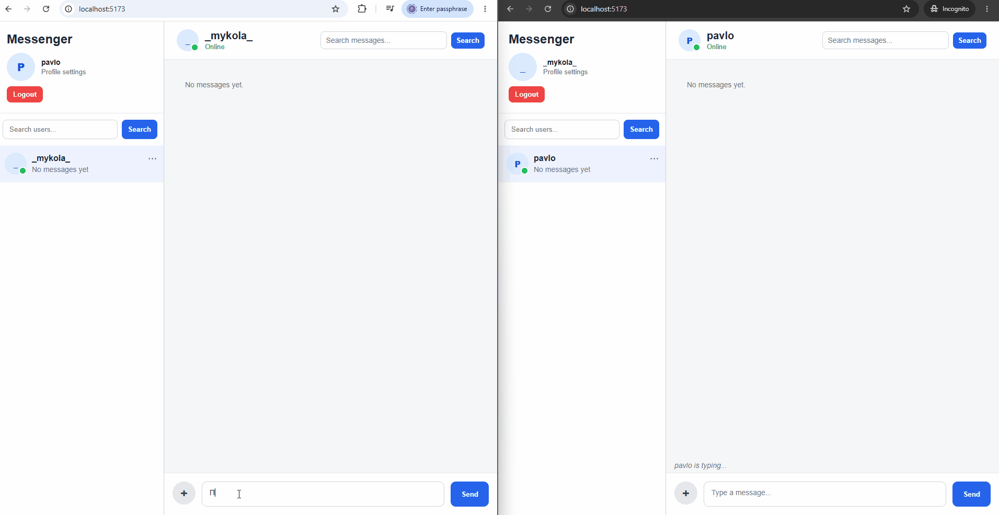
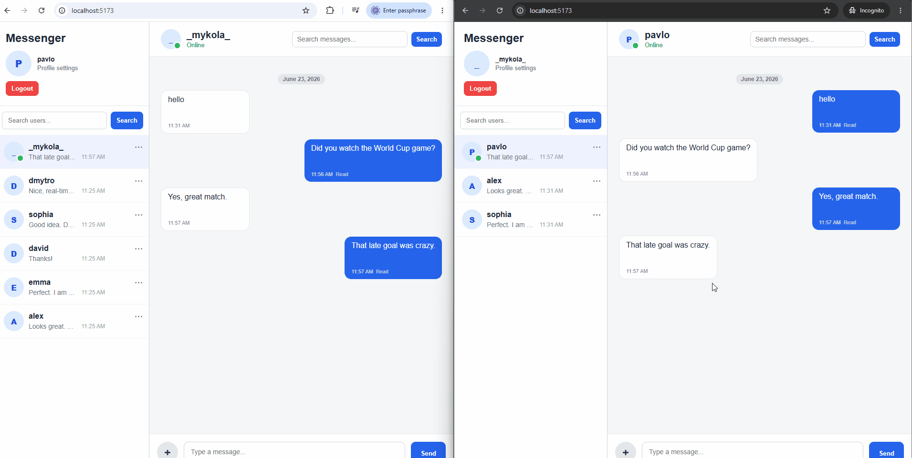
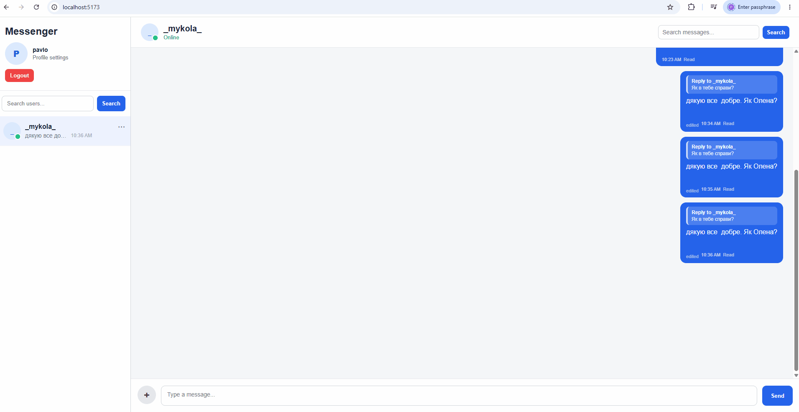
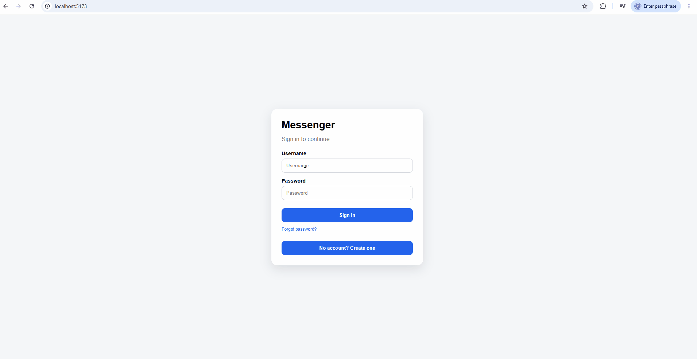
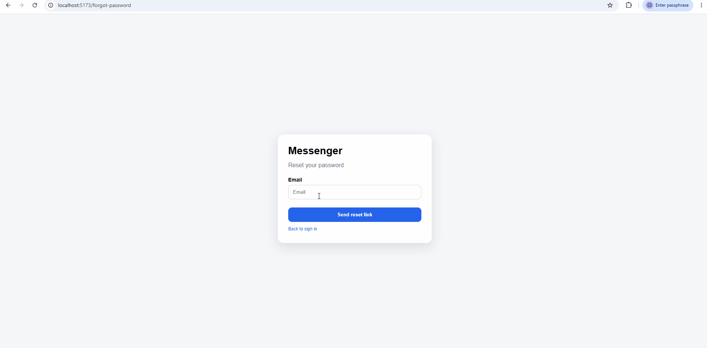
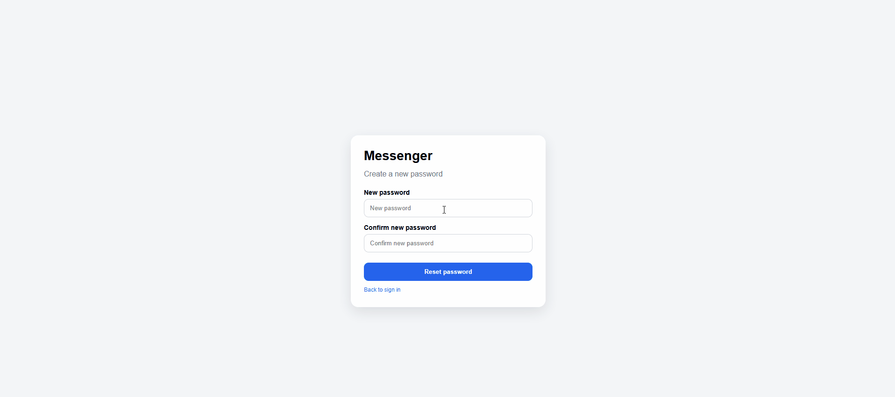
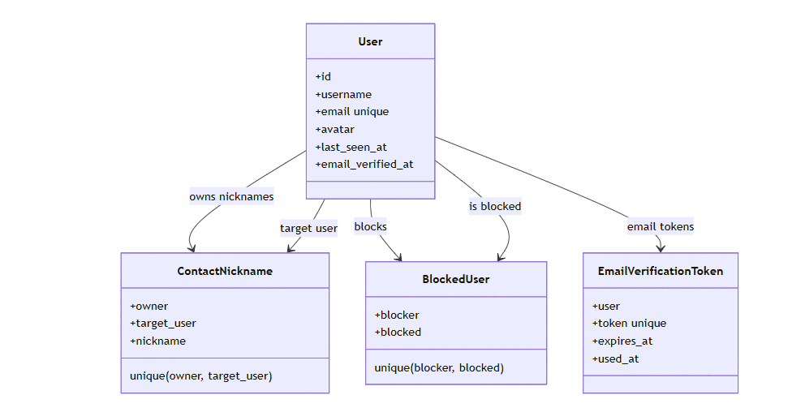
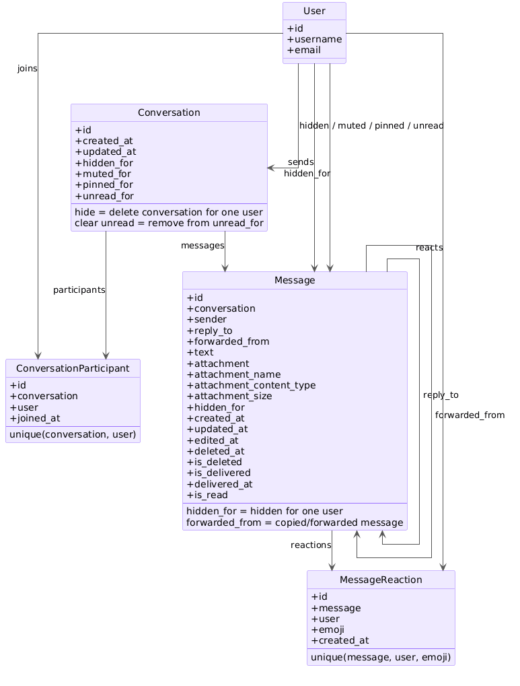
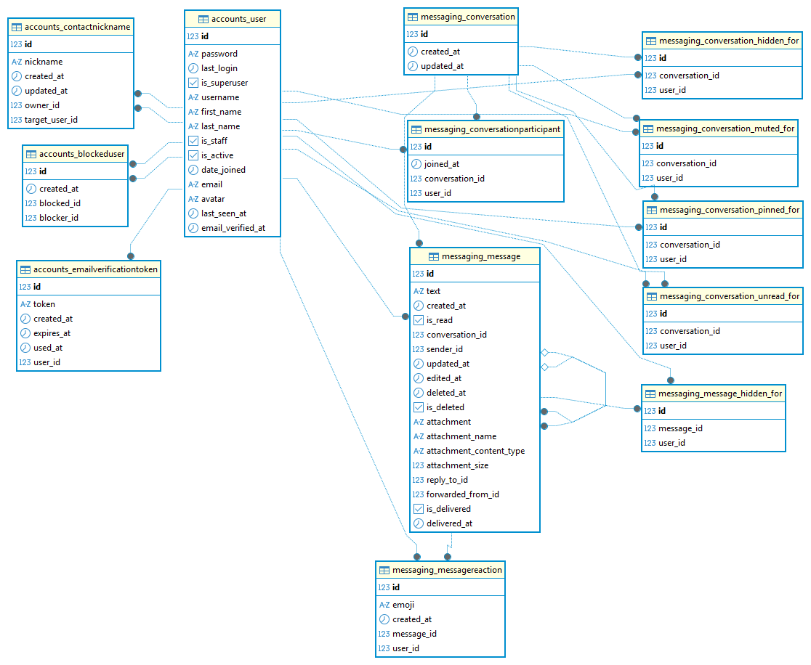

 ## Project Overview
A full-stack real-time messaging application built with Django, Django REST Framework, Django Channels, Redis, PostgreSQL, React, TypeScript, Vite, and Docker Compose.

## Key features

* JWT authentication and user authorization
* User registration, login, logout, and profile management
* Email verification with resend support
* Email re-verification after profile email change
* Password reset via email
* SMTP email configuration for verification and password reset flows
* Profile email verification status in the UI
* Automatic frontend sync for email verification state
* Avatar upload, update, and deletion
* Private conversations between users
* Real-time messaging using WebSockets
* Typing indicator and online/offline status
* Message editing, deletion, replies, forwarding, reactions, search and pagination
* File and image attachments
* User blocking and unblocking
* Conversation pinning, muting, clearing, and deletion
* Real-time sidebar and profile updates

## Screenshots

### Real-time Chat

The real-time chat demo shows two users exchanging messages instantly through WebSockets.



### Message Actions

The message actions demo shows replies, message editing, read status, and message interaction features.



### Profile Settings

The profile settings demo shows user profile management and email verification status behavior.



### Authentication Flow

The authentication flow shows the sign-in page and successful login into the Messenger application.



### Forgot Password

The forgot password demo shows the reset link request form and the confirmation message after submitting an email address.


### Password Reset

The password reset demo shows the email-based password recovery flow, including reset link request and new password confirmation forms.



## Architecture

* **Frontend:** React + TypeScript + Vite
* **Backend:** Django + Django REST Framework + Django Channels
* **Realtime:** WebSockets + Redis
* **Database:** PostgreSQL via Docker Compose
* **Containerization:** Docker + Docker Compose
* **Authentication:** JWT-based authentication
* **Email:** SMTP-based email verification and password reset
* **API:** REST API + WebSocket communication

## Project Diagrams

#### UML Class Diagram

The UML class diagrams show the main Django backend models and their high-level relationships. The database schema diagram below shows the real PostgreSQL tables, foreign keys, unique constraints, and Django many-to-many join tables.

##### Accounts and Authentication Models



##### Messaging Models



#### Database Schema

The database schema diagram shows the main PostgreSQL tables, foreign keys, unique constraints, and Django many-to-many join tables used by the Messenger application.



## Quality and Security

The project includes automated quality and security checks to keep the codebase stable, maintainable, and safer to develop:

### Quality checks

* GitHub Actions CI for backend and frontend
* Backend linting with Ruff
* Frontend linting with ESLint
* Backend tests with Django test framework
* Frontend tests with Vitest
* Backend test coverage reporting with Coverage.py
* Docker Compose configuration validation
* Docker image build checks

### Security checks

* Python dependency security audit with pip-audit
* Frontend dependency security audit with npm audit
* Python code security scanning with Bandit
* CodeQL security scanning
* Dependabot configuration for dependency updates
* Django deployment security checks

### Security-related improvements

* Environment-based configuration using `.env`, `.env.example`, and `.env.production.example`
* Secret key, debug mode, allowed hosts, CORS origins, CSRF trusted origins, database, Redis, SMTP, and security settings loaded from environment variables
* Unique email protection at the database and API validation levels
* Email verification is reset when a user changes their email address
* Message attachment validation by file type and file size
* API rate limiting for authentication, token refresh, search, messages, uploads, and user actions
* Production security settings configurable through environment variables
* Proxy SSL settings configurable for reverse proxy deployments
* WebSocket test credentials loaded from environment variables instead of being hardcoded
* Redis health checks and channel layer timeout settings for more stable WebSocket behavior

## CI/CD

GitHub Actions is configured for the Messenger project inside the monorepo.

### The pipeline checks:

* Backend linting
* Backend dependency audit
* Backend security scan
* Django system checks
* Django deployment checks
* Backend tests with coverage
* Frontend dependency audit
* Frontend linting
* Frontend tests
* Frontend production build
* Docker Compose config validation
* Docker image builds

## Running the Project

### Clone the repository
```bash
git clone <repository-url>
cd Web/Messenger
```
### Create environment file

Create a ```.env ``` file in the project root based on ```.env.example.```

For Docker Compose, use service names as hosts:
```bash
DB_ENGINE=django.db.backends.postgresql
DB_NAME=messenger_db
DB_USER=messenger_user
DB_PASSWORD=messenger_password
DB_HOST=postgres
DB_PORT=5432

REDIS_HOST=redis
REDIS_PORT=6379
```
For local backend development outside Docker, use localhost:
```bash
DB_ENGINE=django.db.backends.postgresql
DB_NAME=messenger_db 
DB_USER=messenger_user 
DB_PASSWORD=messenger_password
DB_HOST=127.0.0.1 
DB_PORT=5432

REDIS_HOST=127.0.0.1
REDIS_PORT=6379
```
### Email configuration

For local development without sending real emails, use the console email backend:

```env
EMAIL_BACKEND=django.core.mail.backends.console.EmailBackend
```

With this backend, emails are printed in backend logs.

For real SMTP email delivery, use SMTP settings, for example Gmail SMTP over SSL:

```env
EMAIL_BACKEND=django.core.mail.backends.smtp.EmailBackend
EMAIL_HOST=smtp.gmail.com
EMAIL_PORT=465
EMAIL_HOST_USER=your-email@gmail.com
EMAIL_HOST_PASSWORD=your-gmail-app-password
EMAIL_USE_TLS=False
EMAIL_USE_SSL=True
EMAIL_TIMEOUT=20
DEFAULT_FROM_EMAIL="Messenger <your-email@gmail.com>"
FRONTEND_URL=http://localhost:5173
```

For Gmail, `EMAIL_HOST_PASSWORD` must be a Gmail App Password, not the normal Gmail account password.

`FRONTEND_URL` is used to build email verification and password reset links.

For local development:

```env
FRONTEND_URL=http://localhost:5173
```

For production:

```env
FRONTEND_URL=https://your-frontend-domain.com
```

## Docker Compose
Run the project:
```bash
docker compose up --build
```
This command starts:

* PostgreSQL
* Redis
* Django backend
* React frontend

Stop the project:
```bash
docker compose down
```
Do not use ``` docker compose down -v ``` unless you intentionally want to remove the PostgreSQL volume and delete local database data.
### Open the application

Frontend:
```bash
http://localhost:5173/
```
Backend:
```bash
http://localhost:8000/
```
Backend health endpoint:

```bash
http://localhost:8000/api/health/
```

Expected response:

```json
{"status": "ok"}
```

## Local Backend and Frontend with Docker Services

You can also run backend and frontend locally outside Docker. In this case, PostgreSQL and Redis can still be started with Docker Compose.
### Start PostgreSQL and Redis:

```bash
docker compose up -d postgres redis
```

### Backend

```bash
cd Web/Messenger/backend
python -m venv venv
venv\Scripts\activate
pip install -r requirements.txt
python manage.py migrate
python manage.py runserver
```

### Frontend

```bash
cd Web/Messenger/frontend
npm install
npm run dev
```

## Tests
### Docker Compose
Run backend tests inside the backend container:
```bash
docker compose exec backend python manage.py test
```
Run frontend tests inside the frontend container:
```bash
docker compose run --rm frontend npm run test:run
```
### Local backend and frontend

If you run the backend outside Docker, start PostgreSQL and Redis first:
```bash
docker compose up -d postgres redis
```
Run backend tests locally:
```bash
cd Web/Messenger/backend
python manage.py test
```
Run frontend tests locally:
```bash
cd Web/Messenger/frontend
npm run test:run
```

Run backend quality and security checks locally:

```bash
cd Web/Messenger/backend
python -m ruff check .
python -m pip_audit -r requirements.txt
python -m bandit -r . -x ".\venv,.\accounts\tests.py,.\messaging\tests.py,.\accounts\migrations,.\messaging\migrations"
python -m coverage run manage.py test
python -m coverage report -m
```
Run frontend quality and security checks locally:

```bash
cd Web/Messenger/frontend
npm audit --omit=dev --audit-level=high
npm run lint
npm run test:run
npm run build
```
## Production Deployment

Production-style Docker Compose files are included:

```bash
docker-compose.prod.example.yml
.env.production.example
frontend/Dockerfile.prod
frontend/nginx.conf
DEPLOYMENT.md
```

For production deployment instructions, see:

```bash
DEPLOYMENT.md
```
The production setup includes:

* Daphne ASGI backend
* nginx frontend container
* reverse proxy for `/api/`, `/ws/`, and `/media/`
* PostgreSQL volume
* Redis service for Django Channels
* media volume
* production security settings through environment variables
* deployment config validation
